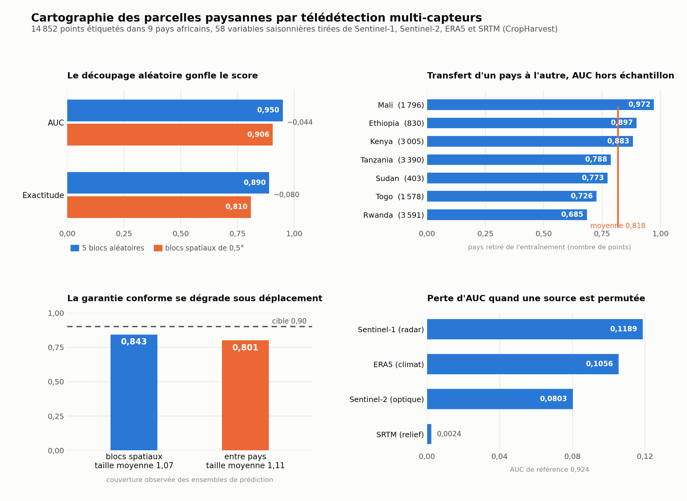
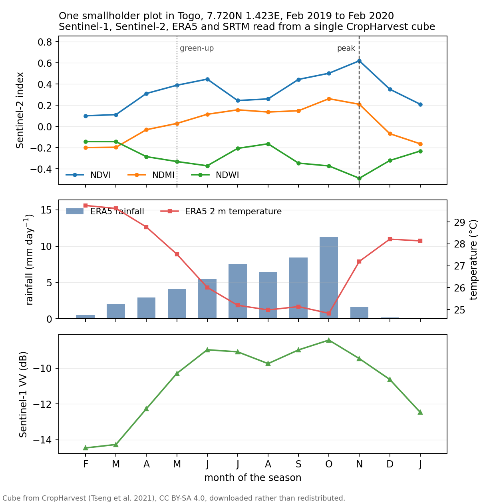

# eo-resilience

Multi-modal Earth observation for smallholder agriculture, from a raw satellite
cube to a spatially honest validation and a calibrated statement of what the
model does not know.

The package was written around a question that recurs in the remote sensing
literature on African agriculture. A classifier trained on labelled field points
scores very well when its test points are drawn at random, then loses a large
part of that score as soon as the test points are held out by location, and
loses more again when it is asked to work in a country it never saw. The code
here measures that gap instead of hiding it, and attaches prediction sets whose
coverage can be checked against its own target.



The figure above comes from `scripts/04_africa_benchmark.py`, run on 14 852
labelled points in Ethiopia, Kenya, Mali, Rwanda, Sudan, Tanzania, Togo, Uganda
and Zimbabwe. Moving from random five-fold splitting to spatial blocks of half a
degree costs 0.044 of AUC and 0.080 of accuracy, so a paper that reports the
random figure overstates what its model would do on new ground. Transfer across
borders ranges from 0.972 when Mali is held out to 0.685 when Rwanda is, which
puts a number on how far a model trained in one agricultural setting can be
carried. Conformal prediction sets built for 90 per cent coverage reach 84.3 per
cent under spatial blocks and 80.1 per cent across borders, a shortfall that is
the expected consequence of exchangeability failing under distribution shift and
that is worth reporting rather than smoothing over. Permuting the Sentinel-1
features costs more AUC than permuting the Sentinel-2 ones, and the ERA5
reanalysis is close behind, which is the empirical case for combining sensors
rather than an assumption about it.

## What is in here

| Module | Contents |
|---|---|
| `bands.py` | the Sentinel-1, Sentinel-2, ERA5 and SRTM band layout, and the index arithmetic that locates a band in a stacked cube |
| `masking.py` | Sentinel-2 scene classification and QA60 cloud masks |
| `indices.py` | NDVI, NDWI, NDMI, NBR and a local texture measure, with safe handling of near-zero denominators |
| `compositing.py` | median composites with a minimum observation count, and seasonal grouping |
| `extraction.py` | point reprojection, windowed sampling with buffers, and raster writing |
| `cube.py` | a `Cube` object over a monthly multi-sensor stack, with band and index accessors |
| `phenology.py` | peak, trough, amplitude, integral, timing and variability statistics per series |
| `validation.py` | spatial blocks, block folds and leave-one-group-out splits |
| `uncertainty.py` | split conformal intervals for regression and conformal label sets for classification, with coverage diagnostics |
| `cropharvest.py` | loading the CropHarvest arrays and turning them into a season feature table |
| `fetch.py` | the thin acquisition layer, STAC search and file download |

The computation layer needs no network and is covered by 95 tests that run on
every push through `.github/workflows/tests.yml`. The acquisition layer is kept
separate and out of continuous integration, since a test that depends on a
remote catalogue fails for reasons that have nothing to do with the code.

## Data

No imagery is committed here. The demo cube is a Sentinel-1, Sentinel-2, ERA5
and SRTM stack over a smallholder plot in Togo, twelve monthly steps from
February 2019 to February 2020, and `sample.py` downloads it on demand into a
local cache. It belongs to CropHarvest and carries a CC BY-SA 4.0 licence, which
is not the licence of this repository, so it is linked rather than copied.

> Tseng, G., Zvonkov, I., Nakalembe, C. L. and Kerner, H. (2021). CropHarvest: a
> global dataset for crop-type classification. *NeurIPS Datasets and Benchmarks
> Track.* https://github.com/nasaharvest/cropharvest



That cube is also what the first script reads. Across the season the optical
signal rises from an NDVI of 0.10 to 0.62 and falls back, the moisture index
follows with a lag, ERA5 rainfall peaks in October while the temperature dips
from 29 to 25 degrees, and the radar backscatter climbs from −14.5 to −8.4
decibels as the canopy fills in. The four sensors tell a coherent story about the
same plot, which is the reason to read them together.

## Running it

```bash
pip install -e ".[test]"
python -m pytest -q

python scripts/00_demo_real_cube.py          # the Togo cube and its figure
python scripts/04_africa_benchmark.py \
    --arrays /path/to/cropharvest/features/arrays
python scripts/05_figures.py                 # the result figures above
```

The benchmark script expects the CropHarvest feature arrays, which are obtained
through the `cropharvest` package rather than from here. It writes its numbers to
`figures/africa_results.json`, and the figure script reads that file, so the
figures can always be traced back to a run.

## Licence

MIT, as for the rest of this repository. The datasets it reads keep their own
licences, which are stated where they are used.
